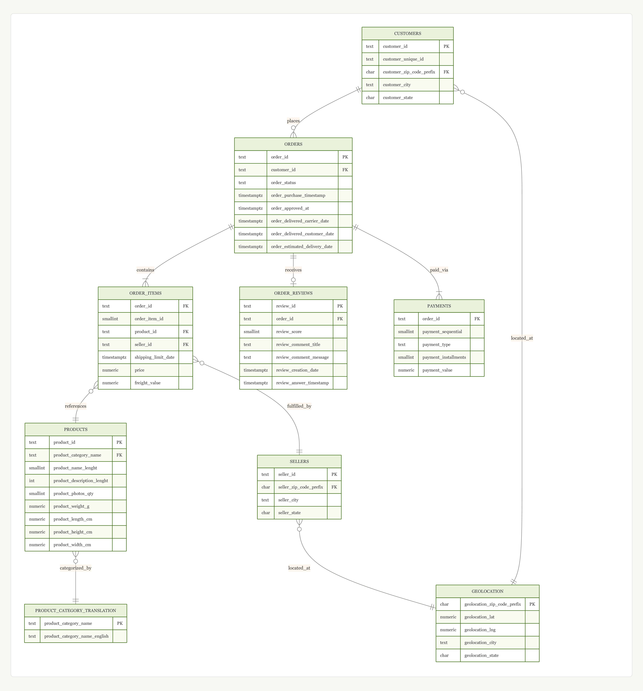

# OlistIQ

OlistIQ is a data engineering pipeline built on the Brazilian E-Commerce dataset by Olist. The goal was to take 9 messy CSV files with Portuguese category names, missing timestamps, incomplete orders and turn them into a clean cloud database with a dashboard on top that answers real business questions.

**Course:** EAS 550 — Data Models & Query Languages · Spring 2026 · University at Buffalo

---

## The Dataset

Real transaction data from [Olist](https://www.kaggle.com/datasets/olistbr/brazilian-ecommerce), a Brazilian marketplace. About 100,000 orders from 2016–2018 across 9 files like orders, customers, sellers, products, payments, reviews, and geolocation.

---

## Phase 1 — Database Design & Ingestion

### What we did

**Designed the schema (Step 1.1)**

We went through all 9 CSV files, figured out what the core entities were and how they connected, then designed a schema in Third Normal Form. The trickiest part was orders and products — one order can have many products and one product appears in many orders, so we used `order_items` as a bridge table to resolve that. Geolocation and category translations each got their own tables to avoid storing the same data in hundreds of rows.

The ERD is in `docs/erd.png` and the full design write-up is in `docs/3nf_justification.md`.



**Built the database on Neon (Step 1.2)**

We provisioned a free PostgreSQL 17 instance on Neon and wrote `schema.sql` to create all 9 tables. The connection string lives in GitHub Secrets and a local `.env` file with nothing hardcoded. Every table has proper constraints: primary keys, foreign keys, NOT NULL where it matters, CHECK constraints on things like review scores (must be 1–5) and order status (only 8 known values).

**Loaded the data (Step 1.3)**

`ingest_data.py` reads all 9 CSVs, cleans them up, and loads them into Neon in the right order so foreign key constraints don't complain. It handles the real data quality issues like zero-weight products, duplicate review IDs, zip codes that need padding, categories that don't have English translations. The script uses append mode for all inserts (never replaces) so existing data is never wiped. It is fully idempotent, we can run it ten times and 
the data stays the same. Everything is loaded programmatically, no manual GUI imports anywhere.

| Table | Rows loaded |
|-------|------------|
| geolocation | 19,015 |
| product_category_name_translation | 71 |
| customers | 99,441 |
| sellers | 3,095 |
| products | 32,947 |
| orders | 99,441 |
| order_items | 112,642 |
| payments | 103,884 |
| order_reviews | 98,167 |

**Set up security (Step 1.4 — bonus)**

`security.sql` creates two roles: `olist_analyst` (read-only, for BI tools) and `olist_app_user` (read + write, for the dashboard backend). DELETE is revoked from the app user to keep an audit trail.

**Managed Neon compute (Step 1.5)**

We use `NullPool` in SQLAlchemy so every connection closes the moment it's done. Neon pauses compute after 5 minutes of no activity, a standard connection pool would keep it awake and eat through the free tier fast. We also check the Neon dashboard regularly to keep an eye on CU usage.

---

## Files

| File | What it is |
|------|-----------|
| `schema.sql` | Creates all 9 tables |
| `ingest_data.py` | Cleans and loads the CSVs |
| `security.sql` | RBAC roles |
| `docs/erd.png` | Entity relationship diagram |
| `docs/3nf_justification.md` | Schema design write-up |
| `.github/workflows/ci.yml` | Runs connection and syntax checks on every push |
| `requirements.txt` | Python dependencies |
| `dbt/olistiq/` | Full dbt project — staging and mart models |
| `docs/star_schema.png` | Star schema diagram |
| `docs/dbt_lineage.png` | dbt lineage graph |
---

## CI/CD

Every time anyone pushes to main, GitHub Actions automatically runs two checks:

- Connects to Neon using the `DATABASE_URL` secret and confirms all 9 tables exist
- Validates that `schema.sql` contains proper constraints — PRIMARY KEY, FOREIGN KEY, NOT NULL, TIMESTAMPTZ

This means if someone accidentally breaks the schema or the database connection, the pipeline catches it before it merges. No manual testing needed on every push.

The workflow file is at `.github/workflows/ci.yml`.
---

## Demo Video

Phase 1 walkthrough — covers the data model, ERD, schema design, and ingestion pipeline running live.

📹 [Watch on YouTube](https://youtu.be/REPLACE_WITH_YOUR_LINK)
---

## Phase 2 — Analytics Layer & dbt Transformations

### What we did

**Built the dbt transformation pipeline (Step 2.1)**

We configured a dbt project to transform the raw Bronze tables into an analytical Star Schema using the Medallion Architecture. The pipeline has two layers — staging models that clean and rename the raw data, and mart models that join everything into a fact table and dimension tables ready for the dashboard.

Seven staging models handle the Silver layer — one per source table. They rename confusing columns, cast types properly, and add calculated fields like `delivery_delay_days` and `sentiment` on reviews. All staging models are materialized as views so they stay lightweight.

Five mart models build the Gold layer star schema. `fct_orders` is the central fact table joining orders, payments, reviews and item aggregates into one wide table. Four dimension tables — `dim_customers`, `dim_sellers`, `dim_products`, and `dim_dates` — surround it. All mart models are materialized as tables for fast query performance.

The star schema diagram is in `docs/star_schema.png` and the dbt lineage graph is in `docs/dbt_lineage.png`.


**Wrote 31 data quality tests (Step 2.1)**

Every primary key has `unique` and `not_null` tests. `fct_orders.customer_id` has a referential integrity test against `dim_customers`. Review scores are constrained to 1–5 and order statuses to the 8 known values. All 31 tests pass.

```bash
dbt test
# Done. PASS=31 WARN=0 ERROR=0 SKIP=0 TOTAL=31
```

**Generated the data catalog (Step 2.1)**

Running `dbt docs generate && dbt docs serve` produces an interactive data catalog with the full lineage graph — showing exactly how every model flows from raw sources through staging into the Gold layer.

### dbt Models

| Model | Type | Layer | Rows |
|-------|------|-------|------|
| `stg_orders` | view | Silver | 99,441 |
| `stg_customers` | view | Silver | 99,441 |
| `stg_sellers` | view | Silver | 3,095 |
| `stg_products` | view | Silver | 32,947 |
| `stg_order_items` | view | Silver | 112,642 |
| `stg_payments` | view | Silver | 103,884 |
| `stg_order_reviews` | view | Silver | 98,167 |
| `fct_orders` | table | Gold | 99,441 |
| `dim_customers` | table | Gold | 99,441 |
| `dim_sellers` | table | Gold | 3,095 |
| `dim_products` | table | Gold | 32,947 |
| `dim_dates` | table | Gold | 634 |

### Running dbt

```bash
cd dbt/olistiq
dbt run        # build all 12 models
dbt test       # run all 31 tests
dbt docs generate && dbt docs serve   # view lineage graph
```

---

## What's Next

- **Phase 2 remaining** — CI/CD with SQLFluff + dbt tests, advanced SQL queries
- **Phase 3** — Performance tuning, EXPLAIN ANALYZE
- **Phase 4** — Streamlit dashboard on Render
- **Phase 3** — CI/CD with dbt tests
- **Phase 4** — Streamlit dashboard on Render

---

## Running It

```bash
git clone https://github.com/eas550Team10/project_olistiq.git
cd project_olistiq
python -m venv venv
source venv/bin/activate
pip install -r requirements.txt
```

Create a `.env` file with your Neon connection string:
```
DATABASE_URL=postgresql://...
```

Run the schema in Neon SQL Editor, then:
```bash
python ingest_data.py --data-dir ./data
```

---

## Team

Krishna Teja Anumolu · Bandlamudi Sharan · Shreyas Aravind · Parameshwaran Arrakutti Anandhakumar

EAS 550 — Spring 2026 · University at Buffalo
