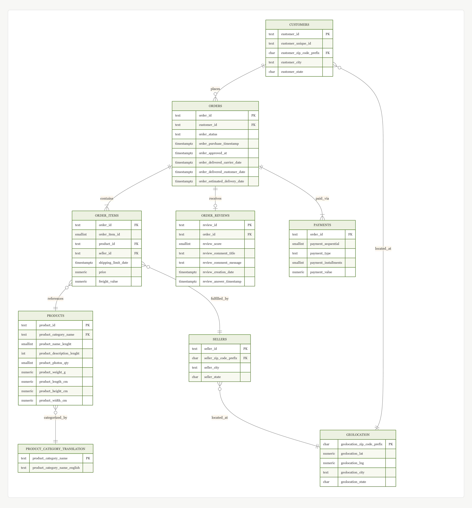
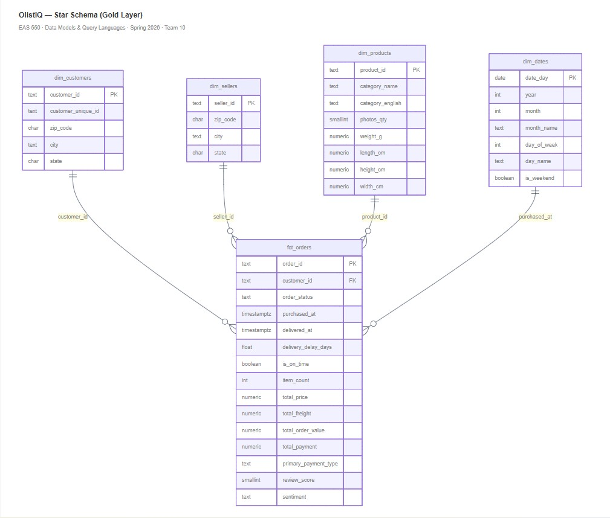
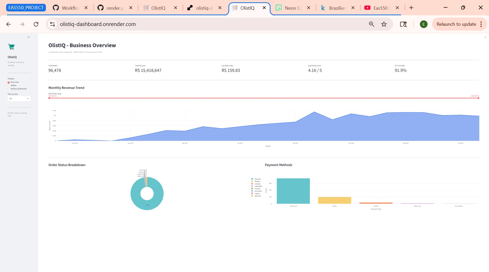
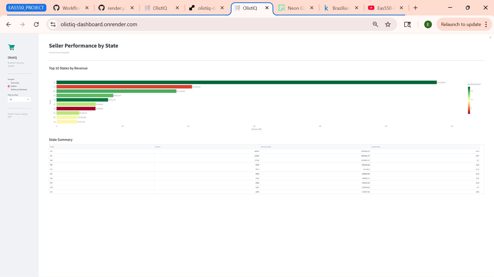
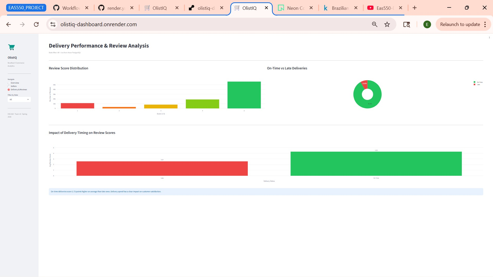

# OlistIQ

OlistIQ is a full end-to-end data engineering pipeline built on the Brazilian E-Commerce dataset by Olist. The goal was to take 9 messy CSV files — Portuguese category names, missing timestamps, incomplete orders and turn them into a clean cloud database, an analytics layer, and a live interactive dashboard that answers real business questions.
 
**Course:** EAS 550 — Data Models & Query Languages · Spring 2026 · University at Buffalo
 
**Live Dashboard:** [https://olistiq-dashboard.onrender.com](https://olistiq-dashboard.onrender.com)

---
 
## The Dataset
 
Real transaction data from [Olist](https://www.kaggle.com/datasets/olistbr/brazilian-ecommerce), a Brazilian marketplace. About 100,000 orders from 2016–2018 across 9 CSV files — orders, customers, sellers, products, payments, reviews, and geolocation.
 
---
 
## Architecture
 
The project was built in three phases, each building on the last — from raw data to a live dashboard.
 
```
Raw CSVs (9 files, 100k+ rows)
        │
        ▼
ingest_data.py (Pandas + SQLAlchemy + NullPool)
        │
        ▼
Neon PostgreSQL ── Bronze Layer (9 normalized tables, 3NF schema)
        │
        ▼
dbt ── Silver Layer (7 staging views — cleaned and renamed)
        │
        ▼
dbt ── Gold Layer (5 mart tables — Star Schema)
        │
        ▼
Streamlit Dashboard ── Deployed on Render (live public URL)
```

---

## Phase 1 — Database Design & Ingestion

### What we did

**Designed the schema (Step 1.1)**

We went through all 9 CSV files, figured out what the core entities were and how they connected, then designed a schema in Third Normal Form. The trickiest part was orders and products — one order can have many products and one product appears in many orders, so we used `order_items` as a bridge table to resolve that. Geolocation and category translations each got their own tables to avoid storing the same data in hundreds of rows.

The ERD is in `docs/erd.png` and the full design write-up is in `docs/3nf_justification.md`.



**Built the database on Neon (Step 1.2)**

We provisioned a free PostgreSQL 17 instance on Neon and wrote `schema.sql` to create all 9 tables. The connection string lives in GitHub Secrets and a local `.env` file with nothing hardcoded. Every table has proper constraints: primary keys, foreign keys, NOT NULL where it matters, CHECK constraints on things like review scores (must be 1–5) and order status (only 8 known values).

**Loaded the data (Step 1.3)**

`ingest_data.py` reads all 9 CSVs, cleans them up, and loads them into Neon in the right order so foreign key constraints don't complain. It handles the real data quality issues like zero-weight products, duplicate review IDs, zip codes that need padding, categories that don't have English translations. The script uses append mode for all inserts (never replaces) so existing data is never wiped. It is fully idempotent, we can run it ten times and 
the data stays the same. Everything is loaded programmatically, no manual GUI imports anywhere.

| Table | Rows loaded |
|-------|------------|
| geolocation | 19,015 |
| product_category_name_translation | 71 |
| customers | 99,441 |
| sellers | 3,095 |
| products | 32,947 |
| orders | 99,441 |
| order_items | 112,642 |
| payments | 103,884 |
| order_reviews | 98,167 |

**Set up security (Step 1.4 — bonus)**

`security.sql` creates two roles: `olist_analyst` (read-only, for BI tools) and `olist_app_user` (read + write, for the dashboard backend). DELETE is revoked from the app user to keep an audit trail.

**Managed Neon compute (Step 1.5)**

We use `NullPool` in SQLAlchemy so every connection closes the moment it's done. Neon pauses compute after 5 minutes of no activity, a standard connection pool would keep it awake and eat through the free tier fast. We also check the Neon dashboard regularly to keep an eye on CU usage.

---

## Files

| File | What it is |
|------|-----------|
| `schema.sql` | Creates all 9 tables |
| `ingest_data.py` | Cleans and loads the CSVs |
| `security.sql` | RBAC roles |
| `docs/erd.png` | Entity relationship diagram |
| `docs/3nf_justification.md` | Schema design write-up |
| `.github/workflows/ci.yml` | Runs connection and syntax checks on every push |
| `requirements.txt` | Python dependencies |
---

## CI/CD

Every time anyone pushes to main, GitHub Actions automatically runs two checks:

- Connects to Neon using the `DATABASE_URL` secret and confirms all 9 tables exist
- Validates that `schema.sql` contains proper constraints — PRIMARY KEY, FOREIGN KEY, NOT NULL, TIMESTAMPTZ

This means if someone accidentally breaks the schema or the database connection, the pipeline catches it before it merges. No manual testing needed on every push.

The workflow file is at `.github/workflows/ci.yml`.

---

## Demo Video

Phase 1 walkthrough — covers the data model, ERD, schema design, and ingestion pipeline running live.

📹 [Watch on YouTube](https://youtu.be/3I7amgSjOTM?si=yt1_xPrcljXyXD-e)
---

## Phase 2 — Analytics Layer & dbt Transformations
 
### What we did
 
**Built the dbt transformation pipeline (Step 2.1)**
 
We configured a dbt project to transform the raw Bronze tables into an analytical Star Schema using the Medallion Architecture. The pipeline has two layers — staging models that clean and rename the raw data, and mart models that join everything into a fact table and dimension tables ready for the dashboard.
 
Seven staging models handle the Silver layer, one per source table. They rename confusing columns, cast types properly, and add calculated fields like `delivery_delay_days` and `sentiment` on reviews. All staging models are materialized as views so they stay lightweight.
 
Five mart models build the Gold layer star schema. `fct_orders` is the central fact table joining orders, payments, reviews, and item aggregates into one wide table. Four dimension tables named `dim_customers`, `dim_sellers`, `dim_products`, and `dim_dates` surround it. All mart models are materialized as tables for fast query performance.
 

 
The dbt lineage graph is in `docs/dbt_lineage.png`.
 
**Wrote 31 data quality tests (Step 2.1)**
 
Every primary key has `unique` and `not_null` tests. `fct_orders.customer_id` has a referential integrity test against `dim_customers`. Review scores are constrained to 1–5 and order statuses to the 8 known values. All 31 tests pass.
 
```
dbt test → Done. PASS=31 WARN=0 ERROR=0 SKIP=0 TOTAL=31
```
 
**Generated the data catalog (Step 2.1)**
 
Running `dbt docs generate && dbt docs serve` produces an interactive data catalog with the full lineage graph showing exactly how every model flows from raw sources through staging into the Gold layer.
 
**Set up CI/CD with SQLFluff and dbt (Step 2.2)**
 
GitHub Actions runs on every push to main. It lints all dbt SQL files with SQLFluff, then runs `dbt run` and `dbt test` automatically. If any model breaks or any test fails the pipeline catches it before it merges.
 
**Advanced SQL queries and performance tuning (Step 2.3)**
 
Three complex queries were written using CTEs and window functions — seller geographic reach analysis, monthly revenue trends with running totals, and delivery delay impact on review scores. The most complex query was profiled with EXPLAIN ANALYZE before and after adding composite indexes.
 
| Metric | Before | After | Improvement |
|--------|--------|-------|-------------|
| Execution Time | 780.787 ms | 315.106 ms | 59.6% faster |
| Planning Time | 77.124 ms | 8.291 ms | 89.3% faster |
 
Full report in `queries/performance_tuning_report.md`.
 
### dbt Models
 
| Model | Type | Layer | Rows |
|-------|------|-------|------|
| `stg_orders` | view | Silver | 99,441 |
| `stg_customers` | view | Silver | 99,441 |
| `stg_sellers` | view | Silver | 3,095 |
| `stg_products` | view | Silver | 32,947 |
| `stg_order_items` | view | Silver | 112,642 |
| `stg_payments` | view | Silver | 103,884 |
| `stg_order_reviews` | view | Silver | 98,167 |
| `fct_orders` | table | Gold | 99,441 |
| `dim_customers` | table | Gold | 99,441 |
| `dim_sellers` | table | Gold | 3,095 |
| `dim_products` | table | Gold | 32,947 |
| `dim_dates` | table | Gold | 634 |
 
### Running dbt
 
```bash
cd dbt/olistiq
dbt run                                  # build all 12 models
dbt test                                 # run all 31 tests
dbt docs generate && dbt docs serve      # view lineage graph
```
 
---

## Phase 3 — Streamlit Dashboard

### What we did (Step 3.1)

Phase 3 is where everything we built comes together in a way anyone can actually use. We took the star schema from Phase 2 and built a Streamlit dashboard on top of it — three pages covering business overview, seller performance, and delivery analysis, all pulling live data from Neon PostgreSQL. The app is deployed on Render so it's publicly accessible, and it automatically redeploys whenever we push to GitHub.

**Overview** — five KPI cards across the top show total orders, revenue, average order value, average review score, and on-time delivery rate. Below that is a monthly revenue trend area chart with an interactive date range slider. An order status donut and a payment methods bar chart round out the page.

**Sellers** — top 10 Brazilian states by revenue shown as a horizontal bar chart, color coded by average review score. A summary table below shows the full numbers.

**Delivery & Reviews** — review score distribution from 1 to 5, on-time vs late delivery breakdown, and a bar chart showing how delivery timing affects review scores. A dynamic insight at the bottom calculates the actual score difference between on-time and late deliveries for the selected state.

The state filter dropdown in the sidebar and the date range slider on the revenue chart are the two interactive widgets.







### Secure database access (Step 3.2)

The app connects to Neon using SQLAlchemy with `NullPool` — connections close immediately after each query. `DATABASE_URL` is loaded from an environment variable only, never hardcoded. All queries run live against the database. `@st.cache_data` is on every query function so the app does not hit the database on every interaction — cache refreshes every 5 minutes.

### Deployment (Step 3.3)

Deployed on Render as a web service connected to the GitHub repo. Every push to main triggers an automatic redeploy. `DATABASE_URL` is set as an environment variable in the Render dashboard — no credentials anywhere in the code.

**Live app:** [https://olistiq-dashboard.onrender.com](https://olistiq-dashboard.onrender.com)

---

## CI/CD

Every push to main automatically runs six checks:

- Tests the Neon database connection and confirms all base tables exist
- Validates `schema.sql` has proper constraints — PRIMARY KEY, FOREIGN KEY, NOT NULL, TIMESTAMPTZ
- Checks `ingest_data.py` syntax
- Lints all dbt SQL files with SQLFluff
- Runs `dbt run` to build all 12 models
- Runs `dbt test` to verify all 31 data quality checks pass

The workflow is at `.github/workflows/ci.yml`.
 

## Key Takeaways

Working through this project end to end gave us a clear picture of what a real data engineering pipeline looks like in practice.

The biggest lesson from Phase 1 was that schema design decisions have consequences that show up much later. Putting geolocation in its own table, separating category translations, using a bridge table for order items — these felt like extra work at the time but made the dbt models and dashboard queries much simpler downstream.

Phase 2 showed us why dbt exists. Writing modular SQL SELECT statements that build on each other, with tests that run automatically on every push, is genuinely better than maintaining one large transformation script. The lineage graph made it easy to trace where any piece of data came from at any point.

The performance tuning work was the most concrete learning. Seeing a 59.6% improvement in execution time from two well-placed indexes made the theory real. Sequential scans on large tables are expensive, and indexes work best when they match exactly what the queries filter and join on.

Phase 3 tied everything together. Because the star schema was already clean and structured, the dashboard queries were simple — mostly just `fct_orders` with a join or two. Building the dashboard last made sense because all the hard data work was already done.

---

## Demo Videos

Phase 1 — Data model, ERD, schema design, and ingestion pipeline running live.

📹 [Watch Phase 1 on YouTube](https://youtu.be/3I7amgSjOTM?si=yt1_xPrcljXyXD-e)

Phase 3 — End-to-end walkthrough of the live Streamlit dashboard on Render.

📹 [Watch Phase 3 Demo on YouTube](https://youtu.be/6TPEghF2vNk)

---

## Files
 
| File | What it is |
|------|-----------|
| `schema.sql` | Creates all 9 tables with constraints |
| `ingest_data.py` | Cleans and loads all CSVs into Neon |
| `security.sql` | RBAC roles |
| `requirements.txt` | Python dependencies |
| `render.yaml` | Render deployment config |
| `dbt/olistiq/` | Full dbt project — staging and mart models |
| `streamlit_app/app.py` | Streamlit dashboard |
| `streamlit_app/requirements.txt` | Dashboard dependencies |
| `queries/` | Advanced SQL queries and performance tuning report |
| `docs/erd.png` | Entity relationship diagram |
| `docs/3nf_justification.md` | Schema design write-up |
| `docs/star_schema.jpg` | Star schema diagram |
| `docs/dbt_lineage.png` | dbt lineage graph |
| `docs/query_performance.md` | EXPLAIN ANALYZE report |
| `.github/workflows/ci.yml` | GitHub Actions CI pipeline |
 
---

## Running It

```bash
git clone https://github.com/eas550Team10/project_olistiq.git
cd project_olistiq
python -m venv venv
source venv/bin/activate
pip install -r requirements.txt
```

Create a `.env` file with your Neon connection string:
```
DATABASE_URL=postgresql://...
```

Run the schema in Neon SQL Editor, then:
```bash
python ingest_data.py --data-dir ./data
```

Run the dbt transformations:
```bash
cd dbt/olistiq
dbt run
dbt test
```
Run the dashboard locally:
```bash
streamlit run streamlit_app/app.py
```

---

## Team

Krishna Teja Anumolu · Bandlamudi Sharan · Shreyas Aravind · Parameshwaran Arrakutti Anandhakumar

EAS 550 — Spring 2026 · University at Buffalo
